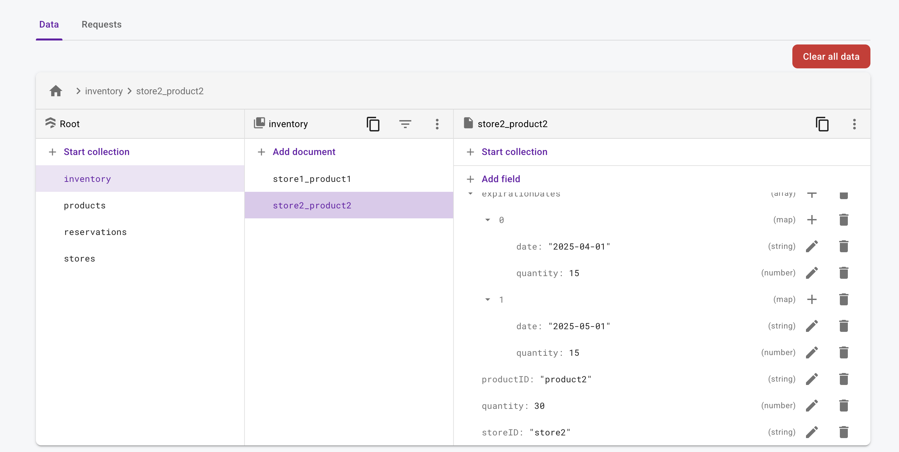

# Firestore Emulator Setup for `firestore.js`

This guide explains how to run the `firestore.js` script using the Firestore Emulator and install necessary dependencies.

## Prerequisites

- **Node.js** installed on your system (v14 or higher recommended).
- **Firebase CLI** installed. If you don't have it, install it globally using:
  ```bash
  npm install -g firebase-tools
  ```

## Setting Up the Firestore Emulator

1. Initialize Firebase in your project if you haven't already:
   ```bash
   firebase init
   ```
   - Select **Emulators** when prompted.
   - Enable the **Firestore Emulator** and choose a default port (default: `8080`).

2. Start the emulator:
   ```bash
   firebase emulators:start
   ```
   Ensure the Firestore emulator is running locally on `localhost:8080`.

## Installing Dependencies

1. Clone the repository or navigate to the folder containing `firestore.js`.
2. Install the required dependencies using npm:
   ```bash
   npm install firebase-admin
   ```

## Running the Script

1. Verify that the Firestore emulator is running.
2. Run the `firestore.js` script:
   ```bash
   node firestore.js
   ```

## What the Script Does

The `firestore.js` script initializes the Firestore database with the following data:

- **Stores**: Information about different stores.
- **Products**: Details about products.
- **Inventory**: Stock levels of products in each store, including expiration dates.
- **Reservations**: Customer reservations for specific products.

Once the script executes successfully, the database in the Firestore Emulator will be populated with this data.

## Troubleshooting

- Ensure the Firestore Emulator is running on `localhost:8080` before executing the script.
- Check for typos or incorrect configurations in the `firestore.js` script.
- If dependencies are missing, run `npm install` again.

## Notes

This setup is for local development only and uses the Firestore Emulator. No data is written to the actual Firestore database.
The UI is also handled in this miniproject, it should be running on `localhost:4000`

## Preview



# Structure de Base de Données NoSQL pour une Gestion de Stock (Firestore)

Cette proposition décrit un schéma de base de données NoSQL à utiliser avec Firestore pour la gestion de stock de produits. Le schéma permet de :

- Gérer le stock de produits (ajout et suppression).
- Gérer un système multi-magasin (un produit peut être dans plusieurs magasins).
- Gérer les dates d'expiration des produits.
- Gérer les réservations (produits commandés mais non encore sortis physiquement).

## Collections et Documents

### 1. `stores` (magasins)
Chaque magasin est représenté par un document unique contenant les informations suivantes :

- **Document ID** : Identifiant unique du magasin.
- **Champs** :
  - `name` : Nom du magasin.
  - `location` : Localisation (adresse).
  - `contact` : Informations de contact.

---

### 2. `products` (produits)
Cette collection contient tous les produits disponibles dans le système.

- **Document ID** : Identifiant unique du produit.
- **Champs** :
  - `name` : Nom du produit.
  - `description` : Description du produit.
  - `category` : Catégorie du produit (ex. : boissons, électronique).

---

### 3. `inventory` (stocks par magasin)
Cette collection gère les stocks des produits par magasin. Chaque document représente un produit dans un magasin spécifique.

- **Document ID** : Combinaison unique de `storeID` et `productID` (ex. : `storeID_productID`).
- **Champs** :
  - `storeID` : Référence au magasin correspondant.
  - `productID` : Référence au produit correspondant.
  - `quantity` : Quantité disponible en stock.
  - `expirationDates` : Tableau des dates d'expiration et des quantités associées. Exemple :
    ```json
    [
      { "date": "2025-02-01", "quantity": 20 },
      { "date": "2025-03-01", "quantity": 30 }
    ]
    ```

---

### 4. `reservations` (réservations)
Cette collection suit les produits réservés par les clients. Chaque document représente une réservation.

- **Document ID** : Identifiant unique de la réservation.
- **Champs** :
  - `storeID` : Référence au magasin.
  - `productID` : Référence au produit réservé.
  - `customerID` : Identifiant du client (optionnel).
  - `quantity` : Quantité réservée.
  - `reservationDate` : Date de la réservation.
  - `status` : État de la réservation (`en attente`, `validée`, `annulée`).

---

## Exemples d'Interactions

### Ajout d'un produit dans le stock d'un magasin
Ajouter un document dans la collection `inventory` avec les champs `storeID`, `productID` et `quantity`.

### Suppression d'un produit
Supprimer le document correspondant dans la collection `inventory` ou mettre le champ `quantity` à 0.

### Gestion des dates d'expiration
Mettre à jour le tableau `expirationDates` dans le document de la collection `inventory`.

### Gestion des réservations
Ajouter un document dans la collection `reservations` avec les informations de la réservation. Mettre à jour la quantité disponible dans la collection `inventory` si la réservation est validée.

---

## Avantages du Schéma

- **Scalabilité** : Conçu pour gérer de grandes quantités de données avec Firestore.
- **Flexibilité** : S'adapte facilement à un environnement multi-magasin avec gestion des dates d'expiration et des réservations.
- **Efficacité** : Les références croisées entre les collections simplifient l'accès et la gestion des données.

---

# Thanks for your time

---

